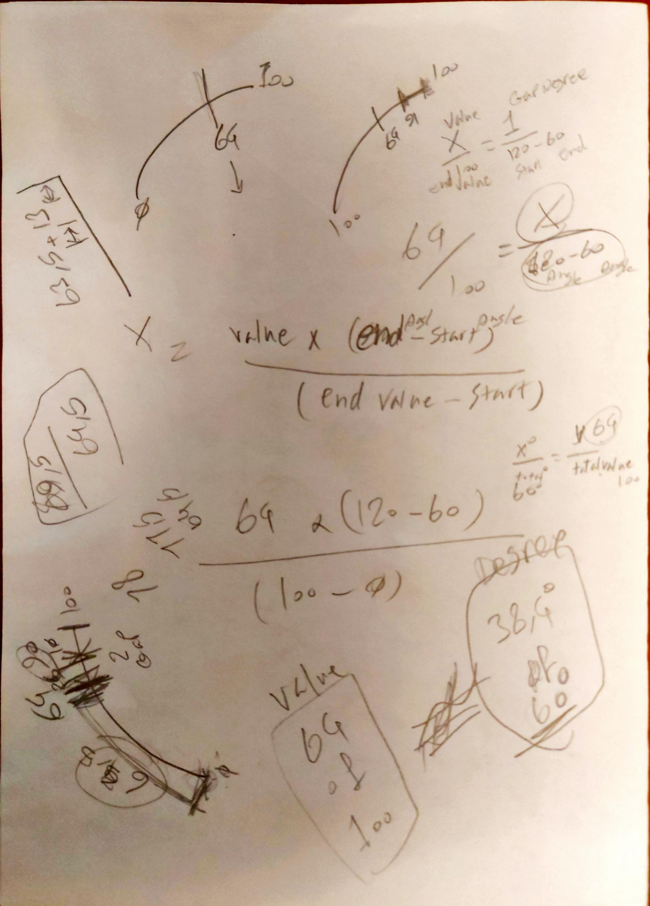

# Car Dashboard Flutter UI Challenge

About project:

Project developed using Flutter framework and Android Studio, Bloc package is used for for state management

project structure:

- assets/image : used image is kept in this folder
- lib/common/ui_configs.dart: global configs are being kept in this file including global colors, teststyles,...
- lib/common/cubit/speedometer : bloc state management for speedometer is implemented here

- lib/common/widgets : global widgets are implemented here in cluding the gauge_progress_indicator.dart, this widget is a CustomePainter what draws all the speedometer elements on the canvas 
- speedometer shape is capable of getting sliced into several parts based on the given parameter

To run:

- After Installing Flutter framework and Android studio or VS Code

- open the sent project and run command below:

  - flutter config --enable-web
  - flutter run -d chrome

  remember, you need Chrome to be installed

this is a very sophisticated parametric speedometer painter app, I used variety of complex calculations to draw the arc shape as it was in the design

